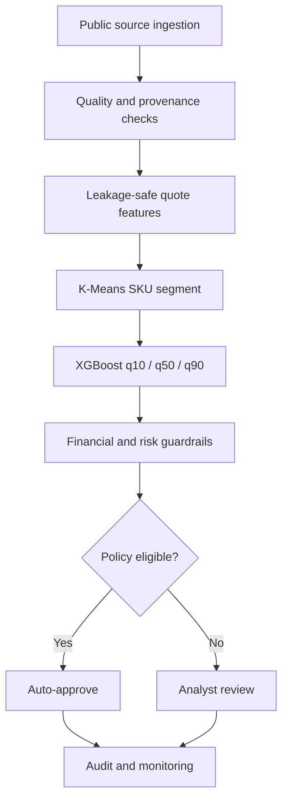

# Enterprise Pricing Recommendation Engine

An end-to-end B2B pricing public-data case study built at realistic catalog and
transaction scale. It does not contain confidential company data.
The project uses public, real product and transaction data, then adds a clearly
labeled deterministic simulation for fields that cannot exist in a public quote
ledger: product cost, contract terms, inventory, customer tier, quote outcomes,
and analyst handling time.

**[Open the live pricing intelligence app](https://enterprise-pricing-recommendation-e.vercel.app/)**

## Validated project statement

> Built an end-to-end pricing recommendation engine for 17,000 computer and
> electronics SKUs across nine markets using XGBoost quantile regression,
> K-Means behavioral segmentation, and multi-layer guardrails. A forward-time
> holdout achieved 46.2% quote auto-approval (44.95% on the validation policy
> calibration set), 9.95% p90 price error on the auto-approved subset, and an
> estimated 4.03x analyst-throughput improvement under documented handling-time
> assumptions.

## What is real and what is simulated

| Layer | Status | Source or rationale |
|---|---|---|
| 17,000 SKU identifiers, titles, prices, brands, ratings, rating counts | Real public data | McAuley Lab Amazon Reviews 2023, Electronics metadata |
| 1,067,371 transaction lines, quantity behavior, countries, customers, cancellations, seasonality | Real public data | UCI Online Retail II |
| Nine market profiles | Real-data derived | UK, Ireland, Germany, France, Netherlands, Spain, Belgium, Switzerland, Portugal |
| SKU product families | Deterministic derived feature | Rules applied to real product titles |
| Unit cost, inventory, contract status, tier, quote outcome | Simulated | Confidential enterprise fields do not exist publicly |
| 180,000 dated quote events | Semi-synthetic | Real catalog + empirical UCI distributions + deterministic business simulation |
| 10 / 4.4 / 0.25 minute handling-time assumptions | Operational assumption | Configurable capacity model, not present in either source dataset |

See [`docs/DATA_CARD.md`](docs/DATA_CARD.md) for complete field-level provenance.

## Measured holdout results

The split is chronological rather than random:

- Train: 126,011 quotes through July 23, 2025
- Validation: 26,991 quotes through October 24, 2025
- Test: 26,998 later quotes through December 26, 2025
- Observed wins in test: 21,109

| Metric | Test result |
|---|---:|
| Auto-approval rate | 46.20% |
| Auto-approved won quote lines | 9,753 |
| Auto-approved subset p90 APE | 9.95% |
| Overall median APE | 4.20% |
| Overall p90 APE | 10.07% |
| 10th–90th quantile coverage | 92.06% |
| MAE improvement vs prior-SKU-price baseline | 24.39% |
| Estimated analyst throughput | 4.03x |

The 92% interval coverage is wider than the nominal 80% interval. That is safe
but conservative; the model card flags interval recalibration as a next step.

## System flow



## Why quantile regression

A point estimate alone hides uncertainty. The service predicts:

- q10: defensive lower estimate
- q50: median commercial recommendation
- q90: upper estimate

The normalized interval width becomes one signal in the confidence score. Wide
intervals, cold-start SKUs, strategic customers, cost shocks, low inventory,
or high-value quotes are routed to an analyst.

## Why K-Means

SKU-level behavioral features are created using only the training period:

- catalog price, rating, and demand proxy
- historical quote count and win rate
- average quantity
- accepted-price-to-list-price ratio and volatility
- number of active markets

Candidate values k=4 through k=8 are evaluated using silhouette score. The
training run selected **k=5**. The clusters are used as a model feature and a
monitoring slice; they are not treated as causal business segments.

## Guardrail layers

1. **Data quality:** positive prices and costs, supported market, valid quantity.
2. **Financial:** tier-specific minimum margin and maximum discount.
3. **Risk:** quote-value cap, cost-shock cap, inventory minimum, minimum history.
4. **Business exceptions:** strategic accounts never auto-approve.
5. **Model confidence:** interval-width ceiling plus a validation-calibrated
   confidence threshold.

The model cannot override a guardrail. The final price is at least:

```text
max(cost / (1 - minimum_margin), list_price * (1 - maximum_discount))
```

## Repository layout

```text
configs/base.yaml                 business and model configuration
data/processed/                   reproducible, derived data products
src/pricing_engine/data_pipeline.py
src/pricing_engine/segmentation.py
src/pricing_engine/modeling.py
src/pricing_engine/guardrails.py
src/pricing_engine/evaluation.py
src/pricing_engine/api.py         FastAPI scoring service
artifacts/models/                 trained models and segment assignments
artifacts/reports/                metrics and scored examples
artifacts/charts/                 performance visuals
tests/                            policy and API tests
docs/                             detailed design, model card, and interview guide
```

## Reproduce the work

```bash
python -m venv .venv
.venv/bin/pip install -e '.[dev]'
.venv/bin/python scripts/download_public_data.py --catalog-size 17000
.venv/bin/python scripts/run_pipeline.py --config configs/base.yaml
.venv/bin/python -m pytest -q
```

Generated Parquet datasets, charts, and serialized models are intentionally
excluded from Git history. The downloader and training pipeline recreate them.
Compact CSV/JSON evaluation reports are included so the documented run remains
auditable without committing large generated binaries.

## Run the API

```bash
PYTHONPATH=src .venv/bin/uvicorn pricing_engine.api:app --port 8000
```

Example request:

```bash
curl -X POST http://localhost:8000/v1/recommend \
  -H 'Content-Type: application/json' \
  -d '{
    "sku_id": "B00003G1I1",
    "market": "DE",
    "quantity": 25,
    "customer_tier": "enterprise",
    "is_contract_customer": true,
    "inventory_weeks": 6.0
  }'
```

Every response includes the price range, policy-adjusted recommendation,
expected margin, confidence, decision, reason codes, and model version.

## Source attribution

- Daqing Chen (2012), *Online Retail II*, UCI Machine Learning Repository,
  DOI: https://doi.org/10.24432/C5CG6D, CC BY 4.0.
- Hou et al. (2024), *Bridging Language and Items for Retrieval and
  Recommendation*, Amazon Reviews 2023: https://amazon-reviews-2023.github.io/
